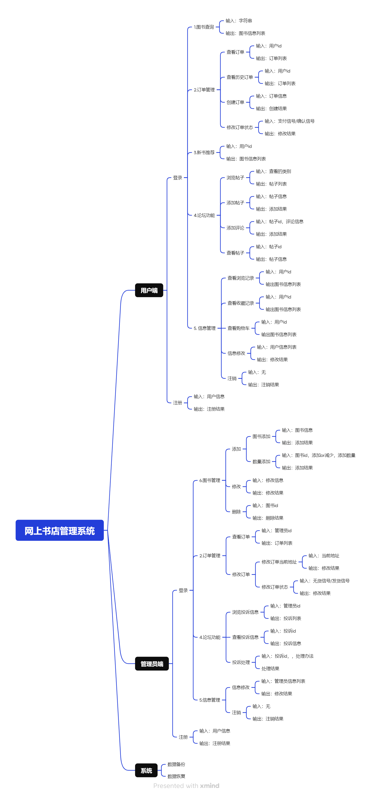

# 需求说明

**45****．网上书店管理系统**

功能需求 : （参考 www.china-pub.com）

(1) 系统管理：用户注册、注销、登陆、修改密码；

(2) 图书查询：图书具有书名、作者、编号（ISBN）、出版社、定价、折扣、 目录、库存状 态等信息。用户可根据书名、作者、出版社等信息进行模糊查询。

(3) 订单管理：用户可通过网络下订单，经检查有效的订单发送到用户信箱，等待用户支付 款项。用户付款后，通过邮局向用户发送图书，并对这一过程进行跟踪管理。

(4) 信息服务：跟踪每一个注册用户购买或浏览习惯，当书库中有此类新书时用电子邮件通 知该用户。

(5) 用户论坛：用户可在此发表书评或进行投诉。

(6) 具有数据备份和数据恢复功能。

# 模块划分

# 数据库设计

### 基本信息

#### 用户信息表（User）

| 属性名          | 数据类型     | 描述                 | 取值范围               | 约束条件           |
| --------------- | ------------ | -------------------- | ---------------------- | ------------------ |
| user_id         | INT          | 用户ID（主键）       | 自增                   | 主键，非空，自增   |
| username        | VARCHAR(50)  | 用户名               | 非空字符串，长度≤50    | 非空，唯一         |
| password        | VARCHAR(100) | 用户密码（加密存储） | 非空字符串，长度≤100   | 非空               |
| email           | VARCHAR(100) | 用户邮箱             | 非空字符串，长度≤100   | 非空，唯一         |
| phone           | VARCHAR(20)  | 用户电话             | 非空字符串，长度≤20    | 非空               |
| register_time   | DATETIME     | 注册时间             | 日期时间格式           | 非空，默认当前时间 |
| last_login_time | DATETIME     | 最后登录时间         | 日期时间格式           | 可空，默认为NULL   |
| default_address | VARCHAR(255) | 默认收货地址         | 可为空字符串，长度≤255 | 可空               |

#### 管理员信息表（Admin）

| 属性名          | 数据类型     | 描述                   | 取值范围             | 约束条件           |
| --------------- | ------------ | ---------------------- | -------------------- | ------------------ |
| admin_id        | INT          | 管理员ID（主键）       | 自增                 | 主键，非空，自增   |
| username        | VARCHAR(50)  | 管理员用户名           | 非空字符串，长度≤50  | 非空，唯一         |
| password        | VARCHAR(100) | 管理员密码（加密存储） | 非空字符串，长度≤100 | 非空               |
| email           | VARCHAR(100) | 管理员邮箱             | 非空字符串，长度≤100 | 非空，唯一         |
| phone           | VARCHAR(20)  | 管理员电话             | 非空字符串，长度≤20  | 非空               |
| register_time   | DATETIME     | 注册时间               | 日期时间格式         | 非空，默认当前时间 |
| last_login_time | DATETIME     | 最后登录时间           | 日期时间格式         | 可空，默认为NULL   |

#### 图书表（Book）

| 属性名      | 数据类型      | 描述                 | 取值范围             | 约束条件                   |
| ----------- | ------------- | -------------------- | -------------------- | -------------------------- |
| book_id     | INT           | 图书ID（主键）       | 自增                 | 主键，非空，自增           |
| title       | VARCHAR(200)  | 书名                 | 非空字符串，长度≤200 | 非空                       |
| author      | VARCHAR(100)  | 作者                 | 非空字符串，长度≤100 | 非空                       |
| isbn        | VARCHAR(20)   | 国际标准书号（ISBN） | 非空字符串，长度≤20  | 非空，唯一                 |
| publisher   | VARCHAR(100)  | 出版社               | 非空字符串，长度≤100 | 非空                       |
| price       | DECIMAL(10,2) | 定价                 | 非负数，最多两位小数 | 非空，大于等于0            |
| discount    | DECIMAL(5,2)  | 折扣                 | 0.00到1.00           | 非空，大于等于0，小于等于1 |
| stock       | INT           | 库存数量             | 非负整数             | 非空，大于等于0            |
| description | TEXT          | 图书描述（如目录等） | 可为空的长文本       | 可空                       |

#### 订单表（Order）

| 属性名          | 数据类型     | 描述                       | 取值范围             | 约束条件                                                     |
| --------------- | ------------ | -------------------------- | -------------------- | ------------------------------------------------------------ |
| order_id        | INT          | 订单ID（主键）             | 自增                 | 主键，非空，自增                                             |
| user_id         | INT          | 下单用户ID（外键）         | 非负整数             | 外键，非空，关联用户表                                       |
| admin_id        | INT          | 发货人ID（管理员ID，外键） | 非负整数             | 外键，非空，关联管理员表                                     |
| order_status    | VARCHAR(20)  | 订单状态                   | 非空字符串，长度≤20  | 非空，默认为“待支付”,  未支付 已支付 已发货 运输中 已完成 订单取消中六选一 |
| order_time      | DATETIME     | 下单时间                   | 日期时间格式         | 非空，默认当前时间                                           |
| payment_time    | DATETIME     | 支付时间                   | 日期时间格式         | 可空，默认为NULL                                             |
| ship_time       | DATETIME     | 发货时间                   | 日期时间格式         | 可空，默认为NULL                                             |
| get_time        | DATETIME     | 收货时间                   | 日期时间格式         | 可空，默认为NULL                                             |
| ship_address    | VARCHAR(255) | 收货地址                   | 非空字符串，长度≤255 | 非空，默认为下单用户默认收货地址                             |
| bill_address    | VARCHAR(255) | 发送地址                   | 非空字符串，长度≤255 | 非空，书店地址                                               |
| current_address | VARCHAR(255) | 当前地址                   | 非空字符串，长度≤255 | 非空，默认为发货地址                                         |
| shipper_phone   | VARCHAR(20)  | 发货人电话                 | 非空字符串，长度≤20  | 非空，默认为发货人电话                                       |
| biller_phone    | VARCHAR(20)  | 收货人电话                 | 非空字符串，长度≤20  | 非空，默认为下单用户电话                                     |
| remark          | TEXT         | 订单备注                   | 可为空的长文本       | 可空                                                         |

### 联合信息

#### 图书标签表（BookTag）

| **属性名**      | **数据类型** | **描述**               | **取值范围**        | **约束条件**                   |
| --------------- | ------------ | ---------------------- | ------------------- | ------------------------------ |
| **book_tag_id** | INT          | 图书标签关系ID（主键） | 自增                | 主键，非空，自增               |
| **book_id**     | INT          | 图书ID（外键）         | 非负整数            | 外键，非空，关联图书表（Book） |
| **tag**         | VARCHAR(50)  | 标签内容               | 非空字符串，长度≤50 | 非空                           |

#### 订单明细表（OrderDetail）

| 属性名     | 数据类型      | 描述               | 取值范围             | 约束条件               |
| ---------- | ------------- | ------------------ | -------------------- | ---------------------- |
| detail_id  | INT           | 订单明细ID（主键） | 自增                 | 主键，非空，自增       |
| order_id   | INT           | 订单ID（外键）     | 非负整数             | 外键，非空，关联订单表 |
| book_id    | INT           | 图书ID（外键）     | 非负整数             | 外键，非空，关联图书表 |
| quantity   | INT           | 购买数量           | 非负整数             | 非空，大于等于1        |
| unit_price | DECIMAL(10,2) | 单价               | 非负数，最多两位小数 | 非空，大于等于0        |

#### 用户浏览表（UserBrowse）
| 属性名      | 数据类型 | 描述               | 取值范围     | 约束条件               |
| ----------- | -------- | ------------------ | ------------ | ---------------------- |
| browse_id   | INT      | 浏览记录ID（主键） | 自增         | 主键，非空，自增       |
| user_id     | INT      | 用户ID（外键）     | 非负整数     | 外键，非空，关联用户表 |
| book_id     | INT      | 图书ID（外键）     | 非负整数     | 外键，非空，关联图书表 |
| browse_time | DATETIME | 浏览时间           | 日期时间格式 | 非空，默认当前时间     |

#### 用户收藏表（UserFavorite）

| 属性名        | 数据类型 | 描述               | 取值范围     | 约束条件               |
| ------------- | -------- | ------------------ | ------------ | ---------------------- |
| favorite_id   | INT      | 收藏记录ID（主键） | 自增         | 主键，非空，自增       |
| user_id       | INT      | 用户ID（外键）     | 非负整数     | 外键，非空，关联用户表 |
| book_id       | INT      | 图书ID（外键）     | 非负整数     | 外键，非空，关联图书表 |
| favorite_time | DATETIME | 收藏时间           | 日期时间格式 | 非空，默认当前时间     |

#### 用户购物车表（UserCart）

| 属性名   | 数据类型 | 描述                 | 取值范围     | 约束条件               |
| -------- | -------- | -------------------- | ------------ | ---------------------- |
| cart_id  | INT      | 购物车记录ID（主键） | 自增         | 主键，非空，自增       |
| user_id  | INT      | 用户ID（外键）       | 非负整数     | 外键，非空，关联用户表 |
| book_id  | INT      | 图书ID（外键）       | 非负整数     | 外键，非空，关联图书表 |
| quantity | INT      | 购物车中图书数量     | 非负整数     | 非空，大于等于1        |
| add_time | DATETIME | 添加到购物车的时间   | 日期时间格式 | 非空，默认当前时间     |

#### 帖子表（ForumPost）

| 属性名       | 数据类型 | 描述               | 取值范围       | 约束条件               |
| ------------ | -------- | ------------------ | -------------- | ---------------------- |
| post_id      | INT      | 帖子ID（主键）     | 自增           | 主键，非空，自增       |
| user_id      | INT      | 发布用户ID（外键） | 非负整数       | 外键，非空，关联用户表 |
| book_id      | INT      | 相关图书ID（外键） | 非负整数       | 外键，可空，关联图书表 |
| content      | TEXT     | 帖子内容           | 可为空的长文本 | 可空                   |
| post_time    | DATETIME | 发布时间           | 日期时间格式   | 非空，默认当前时间     |
| browse_count | INT      | 浏览数量           | 非负整数       | 非空，默认为0          |

#### 评论表（Comment）

| 属性名            | 数据类型 | 描述                   | 取值范围       | 约束条件               |
| ----------------- | -------- | ---------------------- | -------------- | ---------------------- |
| comment_id        | INT      | 评论ID（主键）         | 自增           | 主键，非空，自增       |
| post_id           | INT      | 帖子ID（外键）         | 非负整数       | 外键，非空，关联帖子表 |
| user_id           | INT      | 评论用户ID（外键）     | 非负整数       | 外键，非空，关联用户表 |
| content           | TEXT     | 评论内容               | 可为空的长文本 | 可空                   |
| comment_time      | DATETIME | 评论时间               | 日期时间格式   | 非空，默认当前时间     |
| parent_comment_id | INT      | 父评论ID（外键，可空） | 非负整数       | 外键，可空，关联评论表 |

#### 帖子点赞关系表（PostLike）

| 属性名  | 数据类型 | 描述               | 取值范围 | 约束条件               |
| ------- | -------- | ------------------ | -------- | ---------------------- |
| like_id | INT      | 点赞ID（主键）     | 自增     | 主键，非空，自增       |
| post_id | INT      | 帖子ID（外键）     | 非负整数 | 外键，非空，关联帖子表 |
| user_id | INT      | 点赞用户ID（外键） | 非负整数 | 外键，非空，关联用户表 |

#### 投诉表（Complaint）

| 属性名         | 数据类型    | 描述                         | 取值范围            | 约束条件               |
| -------------- | ----------- | ---------------------------- | ------------------- | ---------------------- |
| complaint_id   | INT         | 投诉ID（主键）               | 自增                | 主键，非空，自增       |
| user_id        | INT         | 投诉用户ID（外键）           | 非负整数            | 外键，非空，关联用户表 |
| content        | TEXT        | 投诉内容                     | 可为空的长文本      | 非空                   |
| complaint_time | DATETIME    | 投诉时间                     | 日期时间格式        | 非空，默认当前时间     |
| status         | VARCHAR(20) | 处理状态（如待处理、已处理） | 非空字符串，长度≤20 | 非空，默认为“待处理”   |
| result         | TEXT        | 处理结果                     | 可为空的长文本      | 可空                   |

#### 建议表（Suggestion）

| 属性名          | 数据类型 | 描述                     | 取值范围       | 约束条件               |
| --------------- | -------- | ------------------------ | -------------- | ---------------------- |
| suggestion_id   | INT      | 建议ID（主键）           | 自增           | 主键，非空，自增       |
| user_id         | INT      | 提交建议的用户ID（外键） | 非负整数       | 外键，非空，关联用户表 |
| content         | TEXT     | 建议内容                 | 可为空的长文本 | 非空                   |
| suggestion_time | DATETIME | 建议提交时间             | 日期时间格式   | 非空，默认当前时间     |

#### 建议赞同关系表（SuggestionAgree）

| 属性名        | 数据类型 | 描述               | 取值范围 | 约束条件               |
| ------------- | -------- | ------------------ | -------- | ---------------------- |
| agree_id      | INT      | 赞同ID（主键）     | 自增     | 主键，非空，自增       |
| suggestion_id | INT      | 建议ID（外键）     | 非负整数 | 外键，非空，关联建议表 |
| user_id       | INT      | 赞同用户ID（外键） | 非负整数 | 外键，非空，关联用户表 |

# 核心需求设计细节

### 1. 订单系统

（1）订单状态

- 未支付
- 已支付
- 已发货
- 运输中
- 已完成
- 订单取消

（2）订单状态转化图

	

# 系统改进与需求升级

1. 短时间并发的生产者消费者问题
